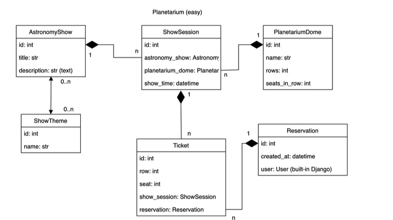

# Planetarium API

API service for planetarium management written of DRF   

## Installing using GitHub

Clone the repository and configure it:

```
git clone https://github.com/dartomOOv/planetarium-api-service.git
cd planetarium-api-service
python -m venv venv
venv\Scripts\activate
pip install -r requirements.txt
```

Then change the name of '.env-sample' file to '.env' and put your own value here to run the django server successfully:

* SECRET_KEY

## Run with Docker

Run the following commands:

```
docker-compose build
docker-compose up
```

### Optional 

If you want, you can load some data into db using commands:

```
docker-compose run app sh -c "python manage.py loaddata data.json"
```

### Run tests with running docker:

* Open new terminal tab;
* Run commands:
* ```docker exec -it <container_name> sh```
* ```python manage.py test```

## Run server locally

Put your own PostgresSQL database values into .env variables:

* POSTGRES_USER
* POSTGRES_PASSWORD
* POSTGRES_DB
* POSTGRES_HOST

Then apply migrations to connected database:

```
python manage.py migrate
```

Run the server via:

```
python manage.py runserver
```

### Optional

If you want, you can load some data into db using commands:

```
python manage.py loaddata data.json
```

## 'env.sample' Explanation

* PGHOST, PGDATABASE, PGUSER, PGPASSWORD - for linking to the PostgreSQL database
* SECRET_KEY - for securing signed data
* POSTGRES_PORT - port on which PostgreSQL is listening for connections.
* PGDATA - the location where PostgreSQL stores its database files inside the container.

## API usage

Users:

* Admin - email: 'admin@admin.com', password - 'Secure_passw0rd'
* User - username: 'user@user.com', password - '1qazcde3'

### This API uses JWTAuthentication, so to see the content of site follow these steps:

* Go to page 'api/user/register/' and create here user(or use given users in README's Users section if you loaded data to db).
* Go to page 'api/user/token/', fill in fields and press button 'POST'.
* You will receive 2 types of token 'refresh' and 'access'. Access is the one you need.
* Go to page 'api/schema/swagger-ui/', press 'authorize' button and put in the given field access token and confirm.
* Now you can use 'api/schema/swagger-ui/' page to see the functionality of API.
* If access token doesn't work(you can check it using 'api/user/token/verify/' url) go to 'api/user/token/refresh/' and put in the given field refresh token.
* If verify token doesn't work, repeat tokens retrieval at 'api/user/token/'.

### If you want to use this API with Postgres, then open page 'api/schema/', where will start downloading of API scheme.

## Db structure used for this project: 


